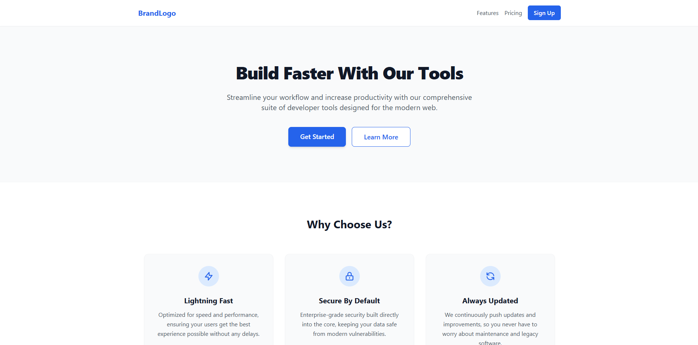
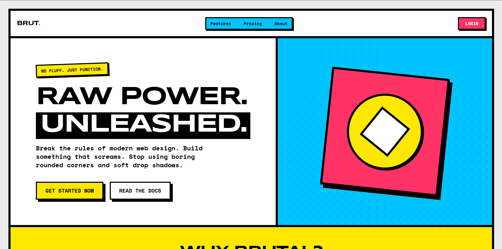

# UnStyle

An MCP (Model Context Protocol) server designed to help LLMs generate beautiful, non-generic, and consistent UI designs. Instead of default Tailwind styles, this tool provides strict aesthetic guidelines, inspiration, rules, and component specifications for specific design themes.

## Example: Before & After
With the same prompt "Create a landing page":

**Before using UnStyle (Generic Tailwind)**


**After using UnStyle (Brutal Theme)**


## Available Themes
- `brutal`: Neo-Brutalism (raw, high contrast, thick borders)
- `pro`: Professional/Enterprise (Linear/Stripe aesthetic, muted, subtle)
- `fun`: Playful/Consumer (bouncy, rounded, colorful)
- `cyberpunk`: High-tech (neon, dark mode, glitchy)
- `minimal`: Bare minimum (whitespace, grayscale, typography focused)

## Quickstart
You can use the server immediately without installing it globally or cloning the repository by using `npx`:

### Using with AI IDEs (Cursor, Antigravity, etc.)
Add the following to your `mcp_config.json` or equivalent configuration file:

```json
{
  "mcpServers": {
    "unstyle": {
      "command": "npx",
      "args": ["-y", "@m0xoo/unstyle"]
    }
  }
}
```


### Testing locally with the MCP Inspector
```bash
npx @modelcontextprotocol/inspector npx -y @m0xoo/unstyle
```

### Using with Cursor
To use this server in Cursor, you need to add it to your Agent config.

1. Open Cursor Settings (`Cmd/Ctrl` + `,`)
2. Navigate to **Features** -> **MCP Servers**
3. Click **+ Add new MCP server**
4. Configure as follows:
   - **Name**: `unstyle` (or whatever you prefer)
   - **Type**: `command`
   - **Command**: `npx`
   - **Args**: `["-y", "@m0xoo/unstyle"]`
5. Save and ensure the status shows green/connected!

Now, when prompting Cursor's Composer or Agent, you can say:
> "Build a login page and use the get_theme_guidelines tool with the 'brutal' theme to style it."

